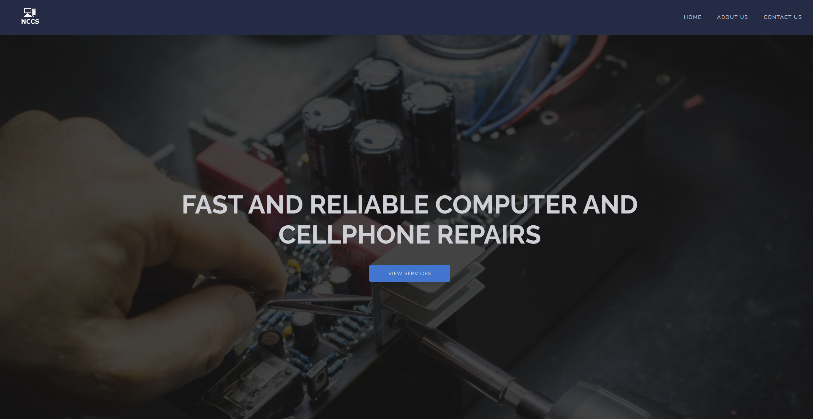

# NCCS (Noel Computer & Cellphone Repair)
## [https://nccs.vercel.app/](https://nccs.vercel.app/)

## About
This is a project I built to practice my web development and design skills. It's mocking a website for a cellphone and computer repair business.

## Built with
These are the tools I used to build this project:
- React
- NextJS
- Styled Components

## Usage instructions
Feel free to fork this project and use it if you'd like, just please give me credit!

### Steps
1. Clone repo.
2. Run `npm install`
3. Run `npm run dev`
4. Make the changes you'd like and then host it whatever you want.